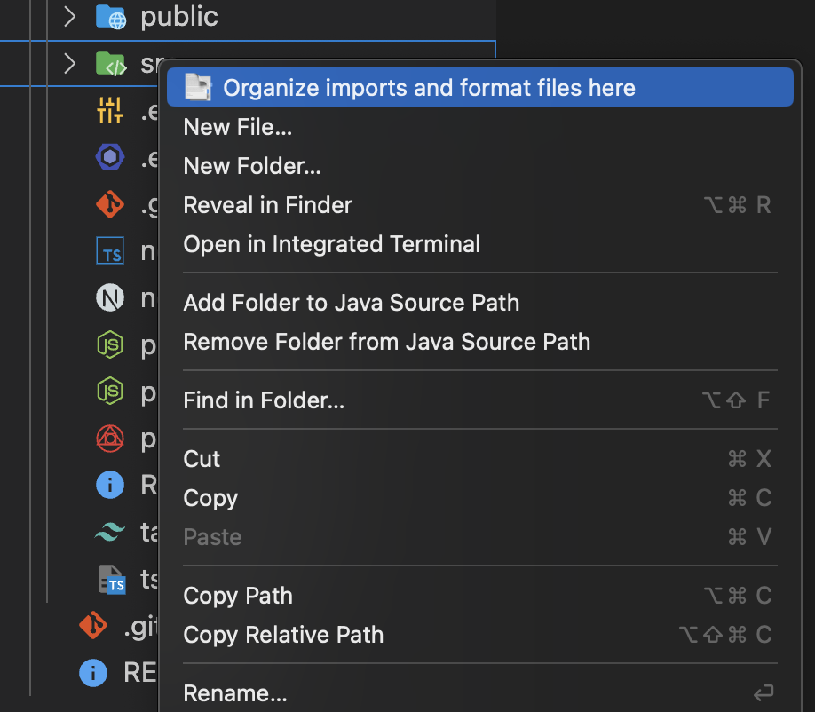

# VS Code Organize and Format 📑

Organizes imports and formats code in all files within a directory and its subdirectories using the default formatter configured for each file type in **VS Code**.

### Benefits

- Enhances productivity.
- Ensures consistent code styling across the project.
- Maintains clean, well-organized code with minimal effort.

### How to use

1. Right-click on a folder;
2. Select the `📑 Organize imports and format files here` option.

### Example

